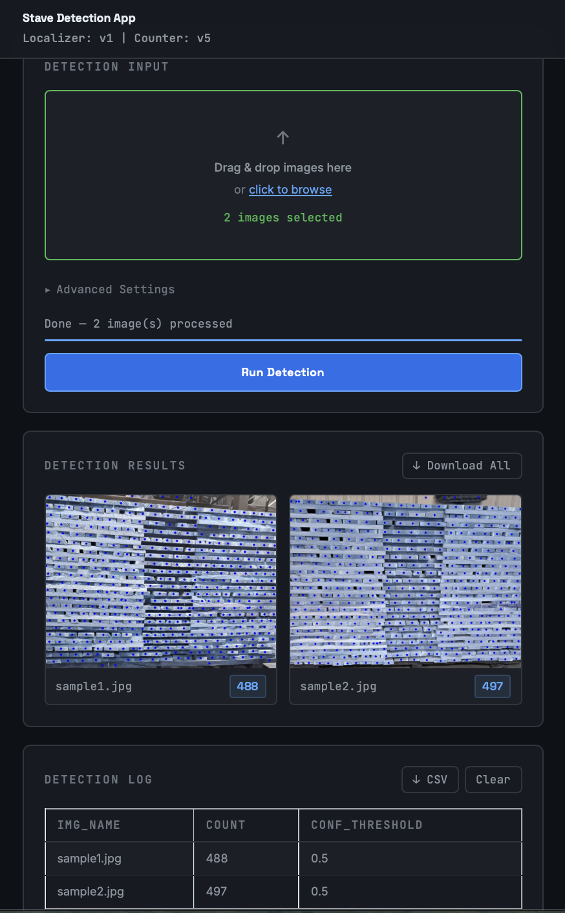
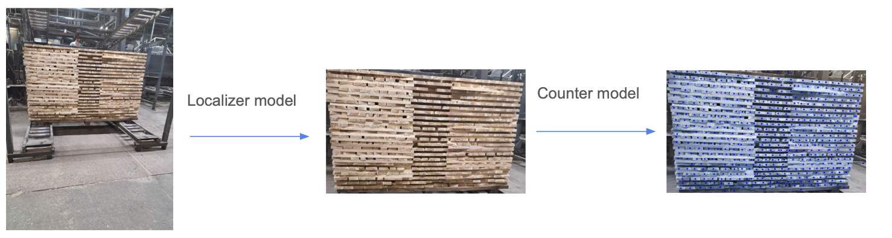
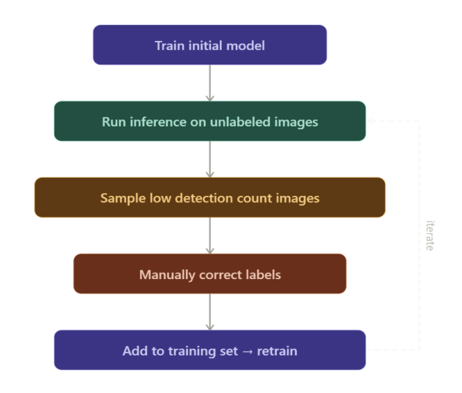
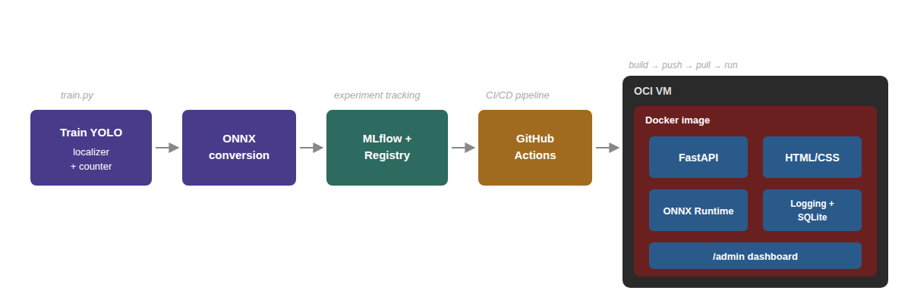

# Staves Detection Machine Learning Project

## Overview

This project automates the wood staves counting process for wood manufacturers. The system uses a two-stage YOLO models: first model localizes the stave pallet region and crops it out, then a counter model counts the individual staves in the cropped regions to produce a tally. It also contains code for the inference web app, with the option to run locally as a docker container or use it live using the URL provided below.

The project includes training scripts (no training data provided) with MLFlow tracking, model export utilities, and a files for the inference web application. All models are exported to ONNX format for efficient production deployment.

## Live Demo:
### **[Try the app here](http://129.146.115.232:8000)**
- Drag & drop the sample images included under the `sample_data` folder
- Press `Run Detection` to start model inference, model outputs are visualized in a card under the Detection Input card
- Under `Advanced Settings`, you can adjust `Confidence Threshold` to surpress low confidence detections (can help reduce false positives) and `IoU Threshold` to reduce overlapping detections


## Repository Structure:
- `main.py`: Entry point for various operations
- `train.py`: Model training scripts (not runnable unless training data is provided)
- `router.py`: FastAPI web application
- `yolo_onnx.py`: ONNX inference utilities
- `yoloPostprocessUtils.py`: Post-processing functions
- `scripts/`: Utility scripts for ONNX model conversion, benchmarking, uploading/downloading model weights from MLFlow (env setup required)
   - `benchmark_and_register.py`: converts PyTorch model to ONNX, benchmarks ONNX model against PyTorch, and saves ONNX model with benchmark results to MLFlow registry 
   - `download_registered_model.py`: pulls models from MLFlow registry, used with Github Actions for build/deployment.
- `static/`: Web frontend files
- `weights/`: Pre-trained model weights
- `colab_files/`: Colab notebook files for experimentation
- `sample_data/`: Example input data


## Running Inference Web Application Locally

### Prerequisites
- Python 3.11-3.13
- `uv` for package installations
- `.env` file, check out the `.env-example`

### Package Installation
```bash
uv sync
```

### Run Web Application
```bash
# Start the FastAPI server
uv run uvicorn router:app --reload --port 8000
```

Open `http://localhost:8000/` in your browser to access the web interface for uploading images and viewing results.


## Model Design Choices

### Two-Stage Pipeline

- **Localizer Stage**: Trains a YOLO model to detect the bounding box of the entire stave pallet, filtering out background objects like other pallets. Crops out the pallet region. 
- **Counter Stage**: Applies a more precise YOLO model to count individual staves within the localized region. <br><br>
Splitting up the model into 2 stages allowed more training data to be curated for the localizer model (due to easier labeling), allowing localizer and counter to improve independently

### Model Architecture
- Used YOLOv11s models for both localizer and counter stages
   - More suitable for deployment in the OCI VM instance which has 2 CPU cores and 12gb RAM, compared to larger YOLO models or RT-DETR
- Both localizer and counter models are converted to ONNX format, inference served using ONNX runtime
   - Achieved 2.5x inference speed up with minimal degradtion in model performance, important for making web application not feel slow

### Data Strategy
- **Domain-relevant pretraining**: Pre-trained counter model on 1,400 
  annotated wood plank images from Roboflow before fine-tuning on the 
  target dataset, yielding +24% mAP50-95 and +10.8% mAP50 improvement
- **Pseudo-label approach for stave labeling**: Scaled labeled dataset from 15 to 70 
  images by using the trained model to identify images where it was 
  undercounting, manually correcting those labels, and retraining 
  iteratively — focusing human annotation effort on model failure cases



## End-to-End System


- **Training**: `train.py` trains the YOLO11s localizer and counter models 
  with MLflow experiment tracking logged to Dagshub
- **ONNX Conversion**: `scripts/benchmark_and_register.py` exports trained 
  PyTorch weights to ONNX, benchmarks latency and throughput against the 
  PyTorch baseline (p50/p95/p99), and registers the ONNX model to the 
  MLflow Model Registry on Dagshub
- **CI/CD**: On push to main, GitHub Actions pulls the registered ONNX model 
  weights from the MLflow registry, builds a Docker image containing FastAPI, 
  the HTML/CSS frontend, and ONNX Runtime, and pushes it to OCI Container 
  Registry
- **Deployment**: The OCI VM pulls the latest Docker image from OCI Container 
  Registry and runs the containerized inference service via URL provided above


## Model Performance
| Metric | Without pretraining | With pretraining |
|---|---|---|
| mAP50 | 0.738 | 0.817 (+10.8%) |
| mAP50-95 | 0.482 | 0.599 (+24.2%) |
| Precision | 0.955 | 0.991 |
| Recall | 0.530 | 0.563 |

## Attribution

### Written by me
- Two-stage pipeline architecture and design decisions
- Data annotation and pseudo-label active learning loop
- train.py — training pipeline with MLflow logging
- router.py — FastAPI inference endpoints and postprocessing
- Docker + OCI deployment configuration
- Colab notebook files for initial model training/experimentation

### Built with AI coding tools (Codex, Claude)
The following created with help of AI coding tools:
- Refactored scripts from Colab notebooks to 
  modular Python scripts
- Frontend redesign (static/index.html, static/styles.css)
- Github Actions Pipeline
- scripts/benchmark_and_register.py — ONNX export and benchmarking
- scripts/download_registered_model.py — MLflow registry model pull


